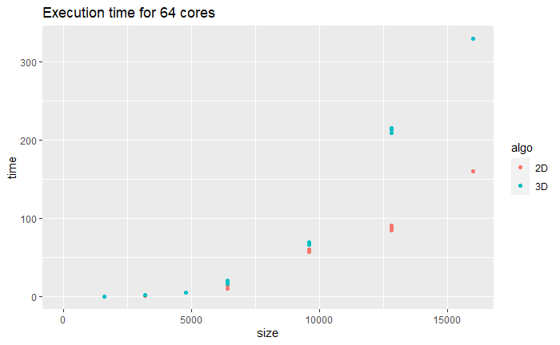
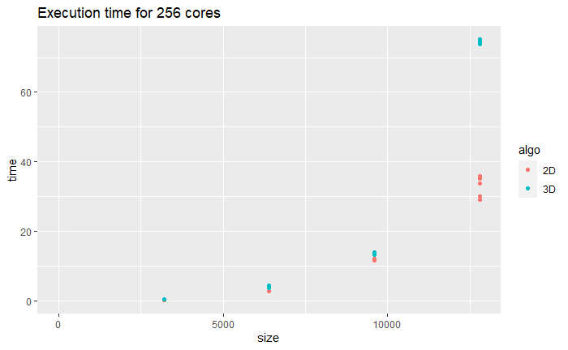
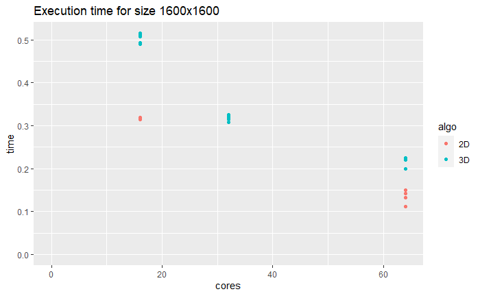
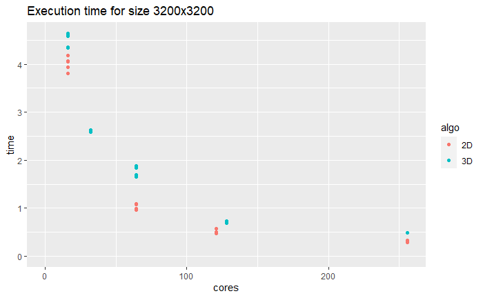
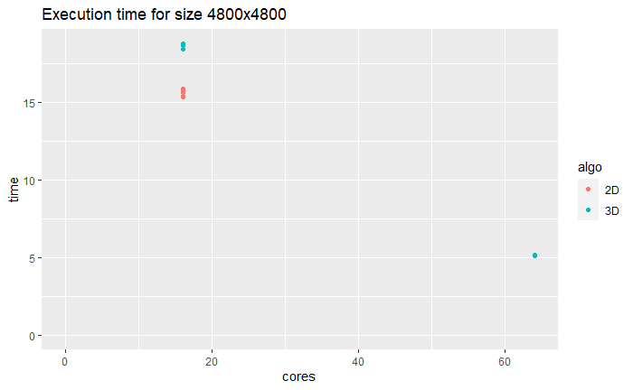
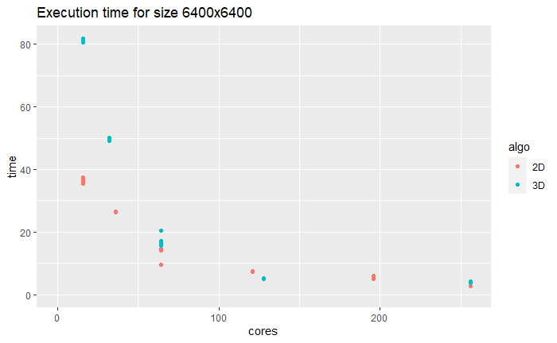
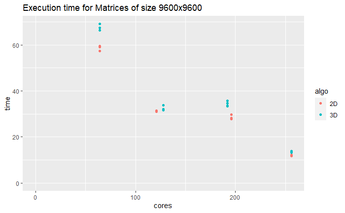
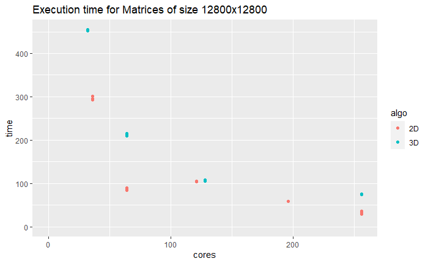

# MPI Project : Comparison of 2 matrix multiplication algorithms

## Introduction

### Goals

My goal is to compare two matrix multiplication algorithm :
* 2D double broadcast matrix multiplication
* 3D matrix multiplication
The goal is to find which algorithm is better for "small" matrices, which one is better for bigger matrices and around where the transition between one algorithm to the other is.

_Hypothesis_: My hypothesis is that, for small matrices the 2D algorithm should perform better, but at some point, the 3D algorithm would catch up and out perform the 2D algorithm.

### Environment

For this project I worked with **python** and **mpi4py**.  
For the data and local matrix multiplication I used the library **numpy**.  
Every local matrix multiplication was done by `numpy.matmul` as it is probably a really good implementation in python.

## 2D Double Broadcast

### Source

In order to implement this algorithm, I used the slide from the class.

### Concept

This algorithm divides the matrices into `q*q = p` parts.
Each process starts with a part of A and B.
Then, at each step i between 0 and q, every process in row i broadcasts its part A to every process in the same column.
Every process in column i broadcast its part of B to every other process in the same row.
Then every matrix compute a local matrix multiplication on the two parts of A and B it as.

### Code

#### Communicators

```python
comm = MPI.COMM_WORLD
rank, size = comm.Get_rank(), comm.Get_size()

Q = int(sqrt(size))

myrow, mycol = int(rank//Q), int(rank%Q)
rowComm, colComm = comm.Split(myrow, mycol), comm.Split(mycol, myrow)
```

Each process finds the row and the column it belongs to. Then, it joins a communicator with every other process in the same row, and a communicator with every process in the same column.

#### Buffers

We initialize two buffer for storing the receive A and B parts, and a buffer for the local part of the result C.

```python
BuffA = np.empty(A.shape, dtype='i')
BuffB = np.empty(B.shape, dtype='i')
C = np.zeros(A.shape)
```

#### Main Loop

```python
for k in range(Q):
	tmpA = A if mycol == k else BuffA
	tmpB = B if myrow == k else BuffB

	rowComm.Bcast(tmpA, root=k)
	colComm.Bcast(tmpB, root=k)

	C += np.matmul(tmpA, tmpB)
```

For each loop, each process sets the variables `tmpA` and `tmpB`. Those variables either hold `A` and `B` if its time for the process to broadcast (send) its part, and `buffA` and `buffB` if it needs to broadcast (receive) the parts of another process. 

Then the process calls the `broadcast` function with `root=k` to broadcast send or receive.

Finally, we do a local `C += matmul(A, B)` with `numpy.matmul`.

At this point, every process owns its part of the final result of the computation.

## 3D Algorithm

### Source

I implemented the 3D matrix multiplication algorithm following this [paper](https://citeseerx.ist.psu.edu/viewdoc/download?doi=10.1.1.120.4575&rep=rep1&type=pdf). All the sections of the code will show the number of the step it corresponds to in the paper.

### Code

#### Useful variables

```python
comm = MPI.COMM_WORLD
rank, size = comm.Get_rank(), comm.Get_size()

m, n, k = M//p1, N//p2, K//p3
k2, n1, n3 = k//p2, n//p1, n//p3

i = rank%p1
j = (rank//p1)%p2
l = (((rank-i)//p1)-j)//p2
```

Each process compute its set of values `i`, `j` and `l`.

#### Communicators (1)

We set the communicators `G_il` for `A` between every processor having the same `(i, l)`.  
We set the communicators `G_lj` for `B` between every processor having the same `(l, j)`.  
We set the communicators `G_ij` for `C` between every processor having the same `(i, j)`.  
However we can't use a tuple as the `color` of the communicator. So, we will take advantage of python's `hash` function that will return a unique integer for every couple (a, b).  
The new rank is equal to the letter not used.

```python
G_il = comm.Split(hash((i, l)), j)
G_lj = comm.Split(hash((l, j)), i)
G_ij = comm.Split(hash((i, j)), l)
```

#### All Gather (2, 3)

The first step is to do an **All Gather** of each part of A and B that processes hold, over their designated communicators.  
We then concatenate the list of arrays back into a matrix.

```python
A_il = np.concatenate(G_il.allgather(A_il_j), axis=1)
B_lj = np.concatenate(G_lj.allgather(B_lj_i), axis=1)
```

#### Local Matmul (4)

Each process then compute its local `matmul(A_il, B_lj)` with `numpt.matmul`.

```python
D_ij_l = np.matmul(A_il, B_lj)
```

#### AlltoAll and sum (5, 6)

We then slice the result and perform an `alltoall` to share the result over the `G_ij` (C dedicated communicators).
Finally, each process `sums` matrices received.

```python
D_ij_r_l = G_ij.alltoall([D_ij_l[:,r*n3:(r+1)*n3] for r in range(p3)])
C_ij_l = sum(D_ij_r_l)
```

At this point, every process owns its part of the final result of the computation.

## Performances 

### Measuring execution time

#### First starting time and last ending time

The first idea was to ask every process to record the time where it starts, and ends computing with `MPI.Wtime()`.
Then, **p0** would gather those times, and the result would be the difference between `max(end_times)` and `min(start_times)`. This would be the `TotalTime` of the algorithm. This method worked pretty well on one node, however, probably due to a bad synchronisation of the nodes clocks, the results were not coherent whith real life time (I would wait 10 seconds but the console would print 70 seconds).

```python
start_time = MPI.Wtime()
# MPI program
end_time = MPI.Wtime()

start_times = comm.gather(start_time, root=0)
end_times = comm.gather(end_time, root=0)

if rank == 0:
	print(round(max(end_times) - min(start_times), 4))
```

#### Maximum span

In order to get more useful data, I change the way of computing the execution time. Each process would compute it time span (difference between ending and starting times), p0 would gather those data and print the maximum span.  
This would differ from the `TotalTime` but should be close enough to be useful.

```python
start_time = MPI.Wtime()
# MPI program
end_time = MPI.Wtime()

span_times = comm.gather(end_time - start_time, root=0)

if rank == 0:
	print(round(max(span_times), 4))
```

### Commands

Here are the commands used : 
* For 2D
```bash
mpiexec -np x -machinefile $OAR_NODEFILE python3 2D.py <size> >> res.csv
```
* For 3D
```bash
mpiexec -np x -machinefile $OAR_NODEFILE python3 3D.py <size> <p1> <p2> <p3> >> res.csv
```

### Results

I used the cluster **Grid5000** to record the execution times of 214 executions.  
The number of cores varies from 16 to 256 cores.  
The size of the matrices tested are 1600, 3200, 4800, 6400, 9600, 12800.  

The execution times can be found in `exp.csv`.

#### Fixed number of cores

First, let's set the number of cores and let the size of the matrices vary. We should be able to see trends on how well the algorithm perform as a function of the size of the matrices.





We can see that for 16, 64 and 256, the 2D algorithm out-performs the 3D algorithm. The difference seems to grow really quickly when the size of the matrices reaches 100 000.

#### Fixed 

Now, let's fix the size of the matrices and let the number of cores vary. We should be able to see if one algorithm performs better as a function of the number of cores.








For matrices of size 6400, we can see that the 3D algorithm is slower with a small amount of cores, but the difference shrinks at 256 cores.
Otherwise, we can see that for each size tested, the 2D algorithm out-performs again the 3D algorithm.

### Conclusion

My experiments showed that **my** implementation of the 2D algorithm is faster than **my** implementation of the 3D algorithm.

When the size of the matrices goes beyond 100 000, the execution time starts to exceed 5 minutes. Multiplying matrices of size of 1 000 000 becomes unreasonable. However, in those ranges we could start to see the 3D algorithm catch up and surpass the 2D algorithm.

Some factors could have influenced and biased the experiments :
* The number of nodes wasn't controlled (sometime, the cores were spread among more nodes than other times).
* The size of the matrices were not random and belong to only a specific set.
* The nodes might have been used while the computation was running.

Finally, because the 2D algorithm outperformed the 3D on every matrice sizes in the range / number of cores, we, sadly, can't answer the question 'where is the transition between 2D and 3D?'.
